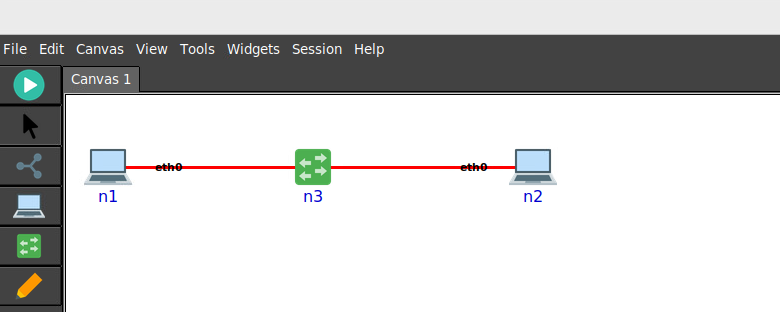
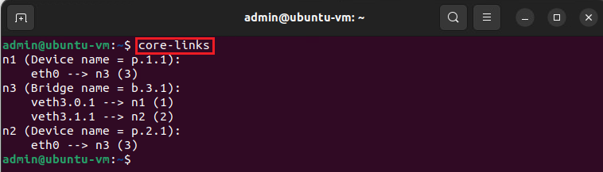

Basic Network Setup
===================

This guide walks you through setting up a basic network topology with one switch and two hosts. 
You’ll learn how to configure IP addresses, run a network emulation, and explore how the switch handles MAC addresses and ARP resolutions. 
This tutorial is designed for beginners, so each step includes explanations to help you understand the underlying concepts.

Topology Setup
--------------
Creating a Three-Node Topology
++++++++++++++++++++++++++++++

**Step 1.** Create a topology with one switch and two hosts as shown in the figure below. Run the network emulation by clicking on the play button.

**Step 2.** Set IP addresses on the hosts: `10.0.0.10/24` for `n1` and `10.0.0.20/24` for `n2`. To set the IP address, enter to the terminal of the hosts by clicking on their icons, and run the following command:
   
- On host `n1`::

   ip addr add 10.0.0.10/24 dev eth0

- On host `n2`::

   ip addr add 10.0.0.20/24 dev eth0

Switching concepts
-----------------------

Getting the bridge (switch) name and connected interfaces
+++++++++++++++++++++++++++++++++++++++++++++++

**Step 1.** Issue the following command on a new terminal started from the host operating system::
      
   core-links

**Step 2.** Inspect the MAC address table on the bridge::

   brctl showmacs b.3.1

Flushing the MAC Address Table
++++++++++++++++++++++++++++++

**Step 3.** Flush the MAC address table on the switch to clear any existing entries.

   - Switch to the root user::
      
      sudo su

   - Flush the MAC address table::

      echo 1 > /sys/class/net/<bridge_name>/bridge/flush

Checking the MAC Address Table
++++++++++++++++++++++++++++++

**Step 4.** After flushing, check the MAC address table to verify it is empty::

   brctl showmacs <bridge_name>

The output should show no learned MAC addresses.

Working with ARP
----------------

Checking ARP Resolutions on the Hosts
+++++++++++++++++++++++++++++++++++++

**Step 5.** On each host, check the ARP table to see the current IP-to-MAC address mappings::

   arp

Flushing ARP Tables on Both Hosts
+++++++++++++++++++++++++++++++++

**Step 6.** To remove all ARP entries on both hosts::

   arp -d -a

This command will delete all ARP entries, forcing the hosts to re-learn the MAC addresses.

Traffic Analysis
----------------

Starting Wireshark on the Switch Interface
++++++++++++++++++++++++++++++++++++++++++

**Step 7.** Start Wireshark on any of the switch’s interfaces to monitor traffic:

   - Launch Wireshark from the command line::

      wireshark

   - Select the appropriate interface to start capturing packets.

Generating Traffic with Ping
++++++++++++++++++++++++++++

**Step 8.** From the first host, send a ping to the second host to generate traffic::

   ping 10.0.0.20

This will cause the hosts to exchange packets, which should be visible in Wireshark.

Verifying MAC Address Learning
++++++++++++++++++++++++++++++

**Step 9.** Check the MAC address table on the switch again::

   brctl showmacs <bridge_name>

You should now see the learned MAC addresses from the ping traffic.

Verifying ARP Resolutions
+++++++++++++++++++++++++

**Step 10.** On the first host, check the ARP table again::

   arp

You should see the MAC address of the second host listed.

