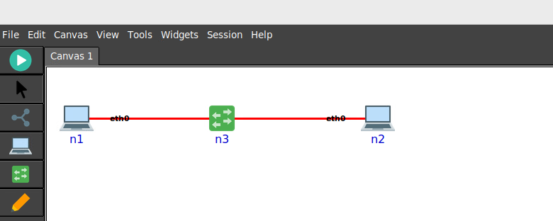
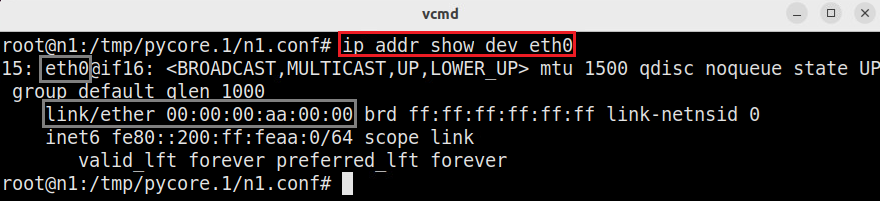
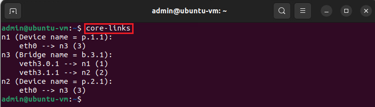
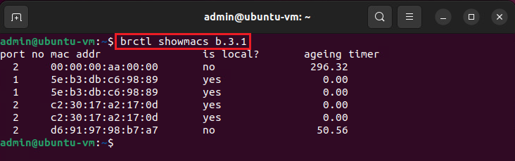
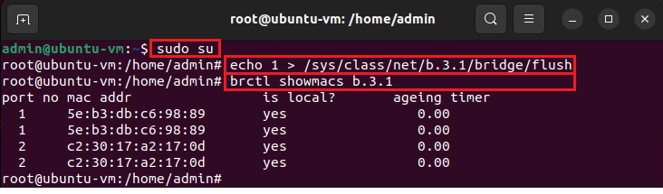
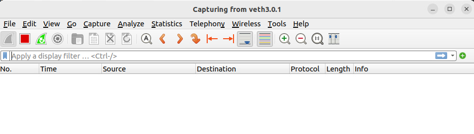
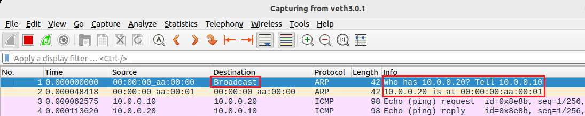
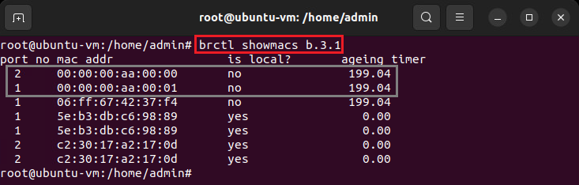
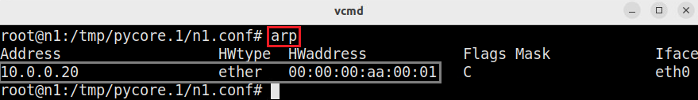

Lab 1: Review on Networking Concepts (Part 1)
===================

This guide walks you through setting up a basic network topology with one switch and two hosts. 
You’ll learn how to configure IP addresses, run a network emulation, explore how the switch handles MAC addresses, and ARP resolutions. 
This tutorial is designed for beginners, so each step includes explanations to help you understand the underlying concepts.

Topology Setup
--------------
Creating a Three-Node Topology
++++++++++++++++++++++++++++++

**Step 1:** Start the emulator by double clicking on the "CORE Emulator" desktop shortcut.

**Step 2:** Create a topology with one switch and two hosts as shown in the figure below. Run the network emulation by clicking on the play button.

.. note::
   - The interface names can be displayed by clicking on View -> Interface Names.
   - The IPv4/IPv6 addresses can be displayed by clicking on View -> IPv4/IPv6 Addresses. Note that we are not configuring default IP addresses in this lab, and thus, you will not see any IP address on the canvas.
   - To enable/disable the canvas grid, click on View -> Canvas Grid.

Assigning IP Addresses
++++++++++++++++++++++++++++++

**Step 1:** Enter to the terminals of hosts ``h1`` and ``h2`` by double clicking on their icons. Then, inspect their IP and MAC addresses by issuing the following command on their terminals::

   ip addr show dev eth0

You will notice that the interface ``eth0`` on ``n1`` has the following MAC address: ``00:00:00:aa:00:00``. However, it does not have an IPv4 address. We will be assigning an IP address in the next step. 
The MAC address of ``eth0`` on ``n2`` is ``00:00:00:aa:00:01``. Take a note of these MAC addresses because they will be used in the upcoming steps. 

**Step 2:** Set IP addresses on the hosts: ``10.0.0.10/24`` for ``n1`` and ``10.0.0.20/24`` for ``n2``. To set the IP address, run the following command:
   
- On host ``n1``::

   ip addr add 10.0.0.10/24 dev eth0

This command assigns the IP address ``10.0.0.10/24`` on the interface ``eth0`` of host ``n1``.

- On host ``n2``::

   ip addr add 10.0.0.20/24 dev eth0

This command assigns the IP address ``10.0.0.20/24`` on the interface ``eth0`` of host ``n2``.

**Step 3:** Inspect again the IP address of ``h1`` and ``h2``:: 

   ip -brief addr show dev eth0

You should see that the IPv4 addresses have been succesfully assigned. 

Switching concepts
-----------------------

Getting the bridge (switch) name and connected interfaces
+++++++++++++++++++++++++++++++++++++++++++++++

**Step 1.** Issue the following command on a new terminal started from the host operating system::
      
   core-links

The output of this command is interpreted as follows:

- The interface ``eth0`` of host ``n1`` is connected to the device ``n3`` (i.e., the switch).
- The interface ``veth3.0.1`` of the switch ``n3`` is connected to the device ``n1``.
- The interface ``veth3.1.1`` of the switch ``n3`` is connected to the device ``n2``.
- The interface ``eth0`` of the host ``n2`` is connected to the device ``n3`` (i.e., the switch).

**Step 2.** Inspect the MAC address table on the bridge::

   brctl showmacs b.3.1

You can see that the MAC table of the switch is populated with multiple entries. The table consists of the port number (``port no``), the learned MAC address (``mac addr``), whether the device is a local interface to the switch (``is local?``), and the time since the MAC address has been learned (``ageing timer``).

Flushing the MAC Address Table
++++++++++++++++++++++++++++++

**Step 1.** Flush the MAC address table on the switch to clear any existing entries.

- Switch to the root user::

   sudo su

- Flush the MAC address table::

   echo 1 > /sys/class/net/b.3.1/bridge/flush

**Step 2.** After flushing, check the MAC address table to verify it is empty::

   brctl showmacs b.3.1

The output should show that the non-local learned MAC addresses are deleted.

Working with ARP
----------------

Checking ARP Resolutions on the Hosts
+++++++++++++++++++++++++++++++++++++

**Step 1.** On each host, check the ARP table to see the current IP-to-MAC address mappings::

   arp

If the hosts attempted to exchange data, the ARP table would be populated with their MAC addresses. Otherwise, the ARP table would be empty.

**Step 2.** Remove the ARP entries on both hosts, if they are present:

- On host ``n1``::

   arp -d 10.0.0.20

- On host ``n2``::

   arp -d 10.0.0.10

This command will delete all ARP entries, forcing the hosts to re-learn the MAC addresses.

Traffic Analysis
----------------

Starting Wireshark on the Switch Interface
++++++++++++++++++++++++++++++++++++++++++

**Step 1.** Using the host OS's terminal, start Wireshark on any of the switch’s interfaces to monitor traffic::

   wireshark -i veth3.0.1 -k

The -k option is to instruct Wireshark to start capturing immediately on the interface. 

Notice that no packets are being seen on the interface. 

Generating Traffic with Ping
++++++++++++++++++++++++++++

**Step 1.** On the terminal of host ``n1``, send a ping to the second host to generate traffic::

   ping -c 1 10.0.0.20

This will cause the hosts to exchange packets, which should be visible in Wireshark.

**Step 2.** Inspect the Wireshark packets.

The output is interpreted as follows:
- Packet 1: The host ``n1`` (identified by its MAC address) sends an ARP request and specifies that the destination MAC is Broadcast (i.e., ``FF:FF:FF:FF:FF:FF``). This packet is asking for the MAC address of ``10.0.0.20``.
- Packet 2: The host ``n2`` (identified by its MAC address) sends an ARP response and tells that the IP address 10.0.0.20 corresponds to the MAC address ``00:00:00:aa:00:01``. The hosts update their ARP caches. 
- Packet 3: The host ``n1`` sends an ICMP Echo Request to ``n2``.
- Packet 4: The host ``n2`` sends an ICMP Echo Reply to ``n1``.

Verifying MAC Address Learning and ARP
++++++++++++++++++++++++++++++

**Step 1.** Check the MAC address table on the switch again::

   brctl showmacs b.3.1

You should now see the learned MAC addresses from the ping traffic.

Verifying ARP Resolutions
+++++++++++++++++++++++++

**Step 2.** On the first host, check the ARP table again::

   arp

Notice how the MAC address of host h2 is now in the ARP cache of host h1. Verify that the MAC address of host ``h1`` is in the ARP cache of host ``h2``.

Stopping the network emulation
++++++++++++++++++++++++++++

Stop the emulation by clicking on the Stop button in the CORE emulator. 

