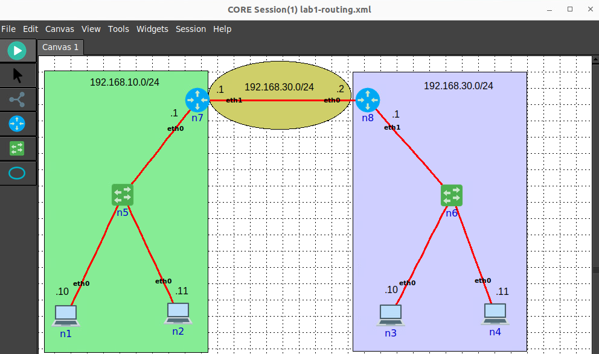
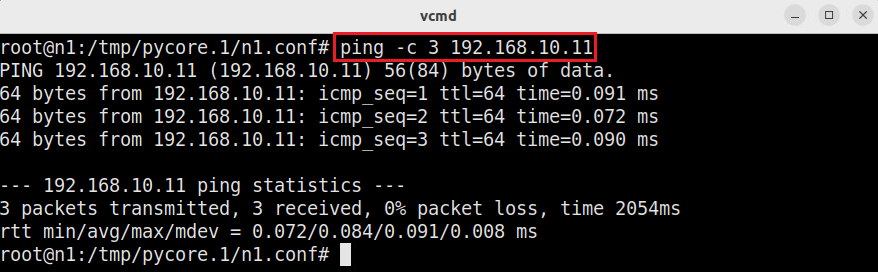
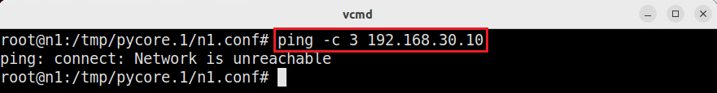
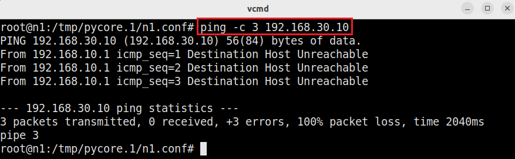

Lab 2: Review on Networking Concepts (Part 2)
===================

This guide walks you through setting up a basic network topology with routers and hosts to demonstrate static routing concepts. You’ll learn how to configure static routes, inspect routing tables, and verify connectivity between hosts. This tutorial is designed for beginners, so each step includes explanations to help you understand the underlying concepts.

Topology Setup
--------------
Creating a Two-Router, Two-Host Topology
++++++++++++++++++++++++++++++

**Step 1:** Start the emulator by double-clicking on the "CORE Emulator" desktop shortcut.

**Step 2:** Load the topology ``lab1-routing.xml`` by clicking on File -> Open -> ``lab1-routing.xml``.

Assigning IP Addresses
++++++++++++++++++++++++++++++

**Step 1:** Set the IP addresses on **all the hosts** by following the IP addressing schemes shown in the topology. 

For example, the host ``n1`` should be configured with the IP address ``192.168.10.10/24``::

   ip addr add 192.168.10.10/24 dev eth0

**Step 2:** Set the IP addresses on **all the routers** by following the IP addressing schemes shown in the topology. While it is possible to use the same commands as those used for setting the IPs for hosts, for routers we will use its Quagga/FRR interface to do so. Quagga/FRR are open-source software routing stacks.

For example, the host ``n1`` should be configured with the IP address ``192.168.10.10/24``::

   ip addr add 192.168.10.10/24 dev eth0

**Step 2:** From host ``n1``, ping host ``n2``::

   ping -c 3 192.168.10.11

You should see a successful ping.  

**Step 3:** From host ``n1``, ping host ``n3``::

   ping -c 1 192.168.30.10

This ping will not be successful. You will see the message ``Network is unreachable``. The reason for this error is that you did not configure the default gateway for the hosts yet. Since ``192.168.30.10`` is on a different network than ``192.168.10.0/24``, the host does not know where to send the packet.

**Step 4:** By configuring a default gateway, the host will know where to forward the packets destined to a different network. Set the default gateway on host ``n1`` by issuing the following command::

   ip route add default via 192.168.10.1

**Step 5:** Try pinging again from host ``n1``, ping host ``n3``::

   ping -c 3 192.168.30.10

Notice that we still do not have connectivity. However, the error message changed from ``Network is unreachable`` to ``Destination Host Unreachable``. We will explain how to fix this next.

- On router `r1`, set IP address `192.168.1.1/24` on `eth0` and `192.168.3.1/24` on `eth1`::

   ip addr add 192.168.1.1/24 dev eth0
   ip addr add 192.168.3.1/24 dev eth1

- On router `r2`, set IP address `192.168.2.1/24` on `eth0` and `192.168.3.2/24` on `eth1`::

   ip addr add 192.168.2.1/24 dev eth0
   ip addr add 192.168.3.2/24 dev eth1

**Step 4:** Inspect the IP addresses again to confirm they are set correctly::

   ip -brief addr show dev eth0

Static Routing Configuration
----------------------------

Configuring Static Routes on Routers
+++++++++++++++++++++++++++++++++++++

**Step 1:** On router `r1`, configure a static route to network `192.168.2.0/24` via router `r2`::

   ip route add 192.168.2.0/24 via 192.168.3.2

**Step 2:** On router `r2`, configure a static route to network `192.168.1.0/24` via router `r1`::

   ip route add 192.168.1.0/24 via 192.168.3.1

**Step 3:** Verify the routing tables on each router:

- On router `r1`::

   ip route show

- On router `r2`::

   ip route show

Checking Connectivity
----------------------

Ping Test Between Hosts
++++++++++++++++++++++++++++++

**Step 1:** On the terminal of host `h1`, send a ping to host `h2` to test connectivity::

   ping -c 1 192.168.2.10

You should receive a response from host `h2` if routing is correctly configured.

**Step 2:** On the terminal of host `h2`, send a ping to host `h1` to verify two-way connectivity::

   ping -c 1 192.168.1.10

Verifying Routing Tables and Traffic
++++++++++++++++++++++++++++++

**Step 1:** Inspect the routing tables on the routers again to ensure the static routes are present.

**Step 2:** Use a tool like `tcpdump` or `wireshark` to capture traffic on the routers' interfaces and verify that packets are being routed correctly.

Stopping the Network Emulation
++++++++++++++++++++++++++++

Stop the emulation by clicking on the Stop button in the CORE emulator.
