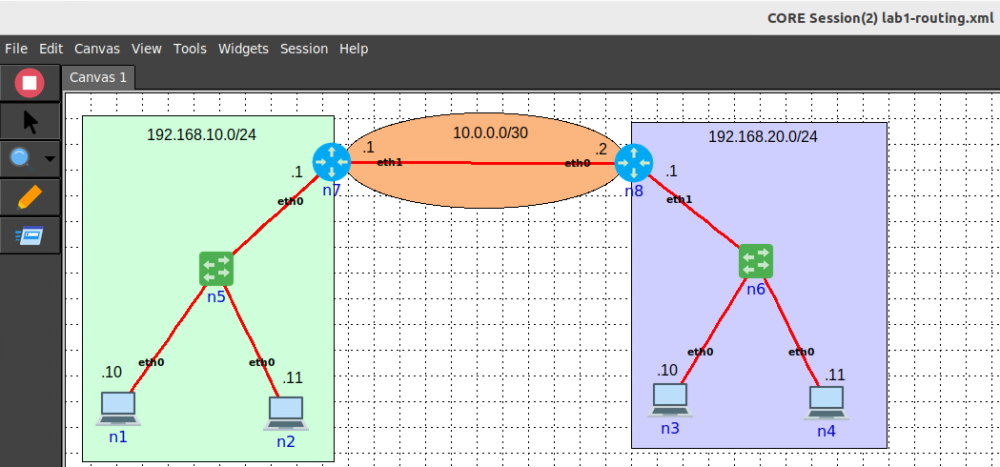
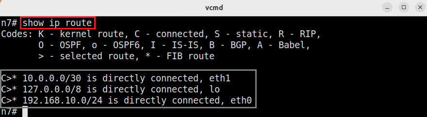

Lab 2: Review on Networking Concepts (Part 2)
===================

This guide walks you through setting up a basic network topology with routers and hosts to demonstrate static routing concepts. You’ll learn how to configure static routes, inspect routing tables, and verify connectivity between hosts. This tutorial is designed for beginners, so each step includes explanations to help you understand the underlying concepts.

Topology Setup
--------------
Creating a Two-Router, Two-Host Topology
++++++++++++++++++++++++++++++

**Step 1:** Start the emulator by double-clicking on the "CORE Emulator" desktop shortcut.

**Step 2:** Load the topology ``lab1-routing.xml`` by clicking on File -> Open -> ``lab1-routing.xml``.

Assigning IP Addresses
++++++++++++++++++++++++++++++

**Step 1:** Set the IP addresses on **all the hosts** by following the IP addressing schemes shown in the topology. 

For example, the host ``n1`` should be configured with the IP address ``192.168.10.10/24``::

   ip addr add 192.168.10.10/24 dev eth0

**Step 2:** Set the IP addresses on **all the interfaces of the the routers** by following the IP addressing schemes shown in the topology. While it is possible to use the same commands as those used for setting the IPs for hosts, for routers we will use its Quagga/FRR interface to do so. Quagga/FRR are open-source software routing stacks.

For example, the interface ``eth0`` on router ``n7`` should be configured with the IP address ``192.168.10.1/24``::

   vtysh

.. code-block:: none

    # configure terminal
        (config)# interface eth0
            (config-if)# ip address 192.168.10.1/24
            (config-if)# exit
        (config)# interface eth1
            (config-if)# ip address 10.0.0.1/30
            (config-if)# exit
        (config)# exit
    #

Now configure the router ``n8`` on your own.
 
**Step 3:** Verify the configuration on the routers by issuing the following command under ``vtysh`` shell::

   show running-config

Testing Connectivity
++++++++++++++++++++++++++++++

**Step 1:** From host ``n1``, ping host ``n2``::

   ping -c 3 192.168.10.11

You should see a successful ping.  

**Step 1:** From host ``n1``, ping the interface ``eth0`` on router ``n7``::

   ping -c 3 192.168.10.1

You should see a successful ping.

**Step 3:** From host ``n1``, ping host ``n3``::

   ping -c 1 192.168.30.10

This ping will not be successful. You will see the message ``Network is unreachable``. The reason for this error is that you did not configure the default gateway for the hosts yet. Since ``192.168.30.10`` is on a different network than ``192.168.10.0/24``, the host does not know where to send the packet.

**Step 4:** By configuring a default gateway, the host will know where to forward the packets destined to a different network. Set the default gateway on host ``n1`` by issuing the following command::

   ip route add default via 192.168.10.1

**Step 5:** Try pinging again from host ``n1``, ping host ``n3``::

   ping -c 3 192.168.30.10

.. image:: ../images/14.png

Notice that we still do not have connectivity. However, the error message changed from ``Network is unreachable`` to ``Destination Host Unreachable``. We will explain how to fix this next.

**Step 6:** Configure the default gateway for all the end-hosts (``n1``, ``n2``, ``n3``, ``n4``)

Static Routing Configuration
----------------------------

Inspecting Routing Tables on the Routers
+++++++++++++++++++++++++++++++++++++

**Step 1:** Inspect the routing table of router ``n7`` by issuing the following command under ``vtysh``:

.. code-block:: none

   # show ip route

The output is the routing table of ``n7``. It has three entries:

   1 - ``10.0.0.0/30``: this network is directly connected (notice the C code at the beginning of the line) to the router on interface ``eth1``.
   
   2 - ``127.0.0.0/8``: this network is for the localhost and is directly connected to the router on the loopback interface ``lo``.
   
   3 - ``192.168.10.0/24``: this network is directly connected to the router on interface ``eth0``.

The ``*`` after each routing table entry means that the route is pushed to the kernel's Forwarding Information Base (FIB). This means that the kernel is aware of these routers. 

The router added those entries automatically to the routing table after we configured the IP addresses on its interfaces. 

.. note::
   The routing table of router ``n7`` does not have an entry to the network ``192.168.20.0/24``. Therefore, all packets destined to ``192.168.20.0/24`` will be dropped. 

**Step 2:** Inspect the routing table of router ``n8``. 

Configuring Static Routes on Routers
+++++++++++++++++++++++++++++++++++++

In this section, we will manually add the routes to the routing tables of the routers. This is known as static routing.

**Step 1:** On router `n7`, configure a static route to network `192.168.20.0/24` under the ``vtysh`` terminal: 

.. code-block:: none

    # configure terminal
        (config)# ip route 192.168.20.0/24 10.0.0.2
        (config)# exit
    #

The ip route command inserts a routing entry statically into the routing table. In this case, a route to the network ``192.168.20.0/24`` has been added. To reach that network, the next hop device is ``10.0.0.2``.

**Step 2:** Inspect the routing table of router ``n7``: 

.. code-block:: none

   # show ip route

Now we can see that a fourth entry has been added. This entry has been added statically (note the ``S`` at the beginning of the line) to reach the network ``192.168.20.0/24`` by taking the exit interface ``eth1`` on the current router. The IP ``10.0.0.2`` corresponds to the next hop (i.e., router ``n8``).

**Step 3:** Configure static routing on router ``n8`` to reach the network 192.168.10.0/24.

**Step 4:** Verify the routing tables on router ``n8``.

Checking Connectivity
----------------------

Ping Test Between Hosts
++++++++++++++++++++++++++++++

**Step 1:** On the terminal of host ``n1``, send a ping to host ``n3`` to test connectivity::

   ping -c 3 192.168.20.10

You should receive a response from host ``n3`` if routing is correctly configured.

**Step 2:** On the terminal of host `n2`, send a ping to host `n4` to verify connectivity.

You should receive a response from host ``n4`` if routing is correctly configured.

Dynamic Routing using RIP
----------------------

**Step 1:** Delete the static route you added on router ``n7``:

.. code-block:: none

    # configure terminal
        (config)# no ip route 192.168.20.0/24 10.0.0.2
        (config)# exit
    #

**Step 2:** Delete the static route you added on router ``n8``:

.. code-block:: none

    # configure terminal
        (config)# no ip route 192.168.10.0/24 10.0.0.1
        (config)# exit
    #

**Step 3:** Open a new terminal on each of the routers, and enter the following command to start the RIP protocol daemon::

   ripd -d

**Step 4:** Configure RIP protocol by entering the following sequence of commands in a vtysh shell on ``n7``:

.. code-block:: none

    # configure terminal
        (config)# router rip
        (config-router)# network 192.168.10.0/24
        (config-router)# network 10.0.0.0/30
        (config-router)# redistribute static

**Step 5:** Configure RIP protocol by entering the following sequence of commands in a vtysh shell on ``n8``:

.. code-block:: none

    # configure terminal
        (config)# router rip
        (config-router)# network 192.168.20.0/24
        (config-router)# network 10.0.0.0/30
        (config-router)# redistribute static
        

**Step 6:** Inspect the routing table on ``n7``::
   
   show ip route

**Step 7:** On the terminal of host ``n1``, send a ping to host ``n3`` to test connectivity::

   ping -c 3 192.168.20.10

You should receive a response from host ``n3`` if routing is correctly configured.

Stopping the Network Emulation
++++++++++++++++++++++++++++

Stop the emulation by clicking on the Stop button in the CORE emulator.
